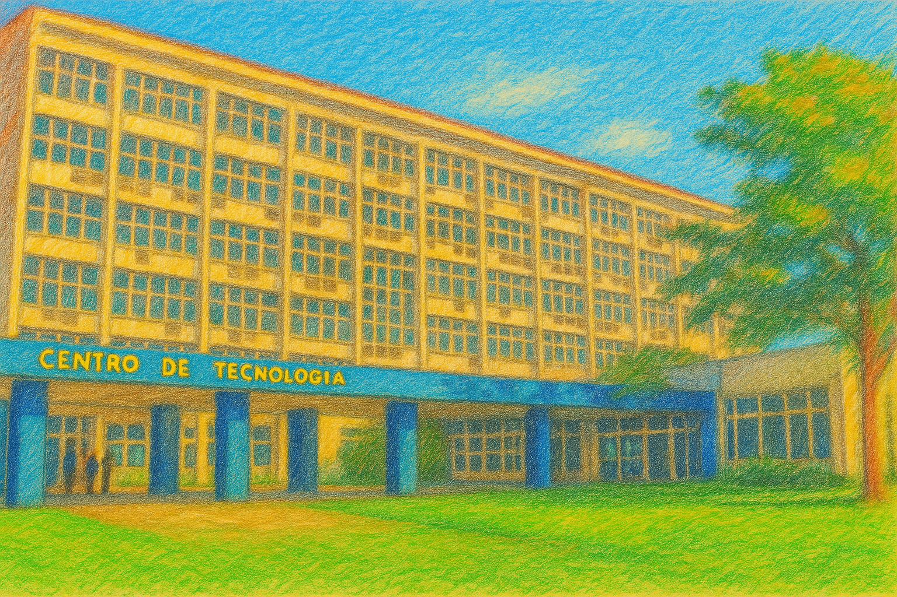

# 8 Ways to Get Auak Back

Este projeto foi desenvolvido como trabalho final da disciplina **Projeto de Jogos**, ministrada pelo professor **Geraldo Xéxeo**, no qual os alunos deveriam **criar um jogo e escrever um artigo** refletindo sobre o processo de desenvolvimento.

---

## Sobre o jogo

**8 Ways to Get Auak Back** nasceu da minha necessidade de lidar com questões pessoais por meio da arte — e, nos últimos tempos, essa arte tem sido a criação de jogos.

O processo de desenvolvimento foi, ao mesmo tempo, criativo e terapêutico. Ao projetar mecânicas, narrativas e atmosferas, encontrei uma forma de transformar sentimentos complexos em uma experiência interativa. O jogo é, portanto, mais do que um exercício técnico: é uma tentativa de dar forma a emoções através do design.

## Cenários
Os cenários dessa Visual Novel são fotografias de  lugares reais convertidas para o estilo artístico escolhido por mim para contar essa história. A arte desse jogo é criada através de prompts para **Inteligência Artificial** uma vez que como universitária não há verba necessária para contratação de designers.
 

## Créditos

Desenvolvido por Thomas Cardoso de Miranda  
Disciplina: Projeto de Jogos  
Professor: Geraldo Xéxeo  
Ano: 2025

